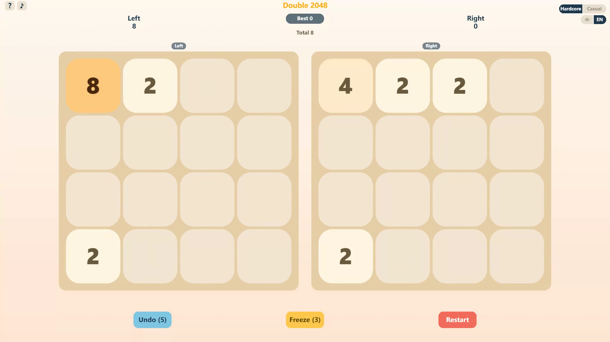
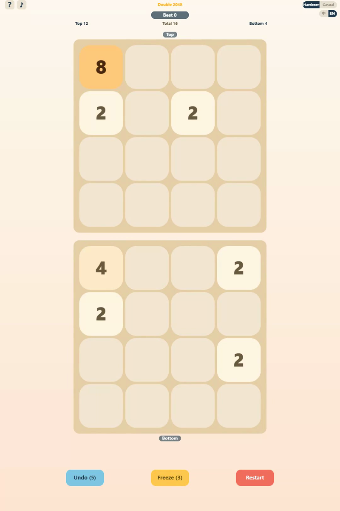

# Simultwin — Dual-board Sync 2048

> **One swipe drives two 2048 boards at once — keep both alive, race to 2048.**
>
> A self-contained HTML5 puzzle game built with Phaser 3. Zero build tools, zero npm
> dependencies, zero backend. It runs as a plain static site from any folder.

[](https://phaser.io/)
[](#development--testing)
[](#tech-stack)
[](#development--testing)
[](#license)

---

## What is it?

Two 4×4 boards sit in a single window — side by side in landscape, stacked in portrait —
and **one swipe (or arrow key) slides both at once**. You plan two grids in parallel,
manage your space on each, and win the moment *either* board reaches 2048. You lose if a
board deadlocks (Hardcore) or if *both* deadlock (Casual).

It is a complete, playable game: two difficulty modes, undo, freeze, bilingual UI,
a how-to-play tutorial, synthesized sound, and responsive layout — all with no external
services.

## Features

- **Dual-board sync** — a single input resolves both boards on the same frame, with
  matched animation timing.
- **Two modes** — *Hardcore* (lose the moment either board locks) and *Casual* (lose only
  when both lock; a board that hits 2048 "retires" instead of ending the run).
- **Undo** — 5 undos per run.
- **Freeze** — 3 freezes; freeze a chosen board for a 5-step countdown, and earn +1 freeze
  every 1000 points.
- **Responsive** — landscape side-by-side / portrait stacked, auto-arranged to the viewport.
- **Bilingual** — English (default) and 中文, switchable from the in-game HUD.
- **Tutorial** — a built-in *How to Play* guide.
- **Synthesized audio** — every sound effect is generated live with the WebAudio API;
  the project ships **no audio files**.
- **Self-contained** — Phaser is vendored locally, the font stack falls back to system
  fonts, and there are no network requests at runtime. Fully playable offline.

## Tech Stack

| Layer | Choice |
| --- | --- |
| Engine | Phaser 3.80.1 (vendored in `vendor/`, no CDN) |
| Language | Vanilla ES Modules (no bundler, no TypeScript) |
| Audio | WebAudio real-time synthesis |
| Tests | Node's native `node --test` runner |

## Project Structure

```
index.html              # entry point; uses relative paths only, runs from repo root
src/                    # 13 game modules (game, board, view, ui, audio, i18n, platform, …)
vendor/phaser.min.js    # localized Phaser engine
tests/                  # 9 test suites, ~489 assertions, zero dependencies
docs/                   # engineering notes
design/                 # GDD, art bible, audio bible, style reference
assets/                 # covers, icons, gameplay screenshots
tools/                  # asset-generation scripts (Python / Node)
```

## Run locally

Because it uses ES Modules, it must be served over `http(s)` — opening `index.html`
directly via `file://` will show a blank screen.

```bash
cd "minigame-Dual 2048"
python -m http.server 8000
# then open http://localhost:8000/
```

(Any static server works — e.g. `npx serve .`.)

## Development & Testing

```bash
node --test tests/
# 9 suites, ~489 assertions — no npm install required (Node native test runner)
```

## Documentation

- [Engineering & build notes](docs/build-notes.md) — architecture, version-control
  exclusions, and local-run / test instructions.
- [GDD v1.0](design/gdd/dual-2048-gdd.md) · [GDD v1.1](design/gdd/dual-2048-gdd-v1.1.md)
  — game design documents.
- [Art bible](design/art/art-bible.md) · [Audio bible](design/audio/audio-bible.md) ·
  [Style reference](design/style-reference.md) — visual & audio direction.

## Screenshots

| Landscape | Portrait |
| --- | --- |
|  |  |

## Known Limitations

- **No accounts / leaderboard.** Progress is stored in the device's `localStorage` only.
- **Rewarded-ad continuation is a stub.** The "watch ad for +5 undos" path is a no-op
  unless an optional integration is wired in (see below).
- **Code-drawn visuals.** Tiles and UI are drawn with Phaser graphics rather than sprite art.

## Optional integration adapter

The codebase includes an optional integration adapter (`src/integration.js`) that stays
inactive by default — it performs no actions unless explicitly activated, so the game is
fully self-contained as shipped.

## License

Released under the [MIT License](LICENSE). Free to use, modify, and redistribute.

---

## 中文说明

**Simultwin（双盘同步 2048）** 是一款自包含的 HTML5 益智游戏：一次滑动同时操控两块 4×4
棋盘，任一块凑出 2048 即获胜；硬核模式下任一块死局即负，休闲模式下仅当两块同时死局才负
（达标棋盘会「退役」而非结束）。

**特性**：双盘同步、硬核/休闲两种难度、5 次撤销、3 次冻结（选盘 + 5 步倒计时，每 1000
分 +1）、横竖屏自适应、中英双语（默认英文，游戏内可切换）、内置新手教程、WebAudio
实时合成音效（无音频文件）、完全离线可玩。

**技术**：Phaser 3.80.1（本地化于 `vendor/`，无 CDN）、原生 ES Modules（无构建工具）、
Node 原生测试（`node --test`）。

**本地运行**：用任意静态服务器打开（因 ES Module 限制，不能直接双击 `file://` 打开）：

```bash
cd "minigame-Dual 2048"
python -m http.server 8000   # 浏览器访问 http://localhost:8000/
```

**许可证**：[MIT](LICENSE)。
